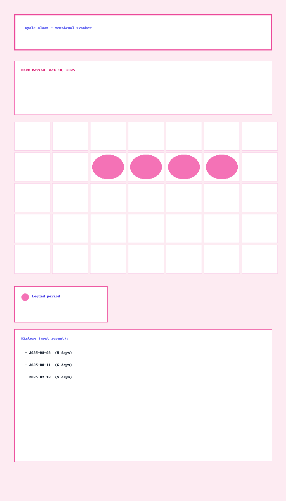

# Menstrual Cycle Tracker

A simple React + Tailwind menstrual cycle tracker (localStorage-based).

## Quick start

1. `npm install`
2. `npm run build`
3. Push to GitHub & connect to Netlify (or drag `build` to Netlify)
